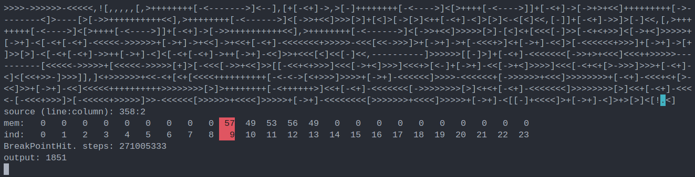

# bf-debugger
An interactive brainfuck executor and debugger. It allows setting memory and code breakpoints, step a number of times, view the memory state and output.



## usage
Specify a source file and optionally an input file:
```
brainfuck path/to/program.bf [path/to/input.txt]
```
### Code breakpoints:
The `!` character will be treated as a breakpoint, stopping execution

### Command list:
`[brackets]` are optional parameters.
- `step [n]`
	- Step the progam n times (this is the default behavior when pressing enter with no command)
- `run`
	- Run the program until the end
- `watch <cell> <value>`
	- Create a breakpoint. Execution will stop when <cell> has <value>
- `quit` | `q` | `exit`
	- Exit the debugger
